# 👥 Person Management System

A full-stack web application built with React, Node.js (Express), PostgreSQL, and Docker Compose. It allows users to create, view, update, and delete person records through a clean and modern UI.

---

## 🛠️ Technologies

- **Frontend:** React, React Router, Axios
- **Backend:** Node.js, Express
- **Database:** PostgreSQL
- **Containerization:** Docker, Docker Compose

---

## 🚀 Setup and Run Instructions

### Requirements
- [Docker Desktop](https://www.docker.com/products/docker-desktop/) must be installed and running.

### Steps

1. Clone the repository:
```bash
   git clone https://github.com/elif-istanbulluoglu/SENG384
   cd SENG384
```

2. Create the environment file:
```bash
   cp .env.example .env
```

3. Start the application:
```bash
   docker compose up --build
```

4. Open your browser:
   - **Frontend:** http://localhost:3000
   - **Backend API:** http://localhost:5000/api/people

5. To stop the application:
```bash
   docker compose down
```

> **Note:** On the first run, Docker will pull the required images. This may take a few minutes.

---

## 📡 API Endpoint Documentation

**Base URL:** `http://localhost:5000/api`

| Method | Endpoint | Description | Request Body |
|--------|----------|-------------|--------------|
| GET | `/people` | Get all people | — |
| GET | `/people/:id` | Get a single person by ID | — |
| POST | `/people` | Create a new person | `{ "full_name": "...", "email": "..." }` |
| PUT | `/people/:id` | Update an existing person | `{ "full_name": "...", "email": "..." }` |
| DELETE | `/people/:id` | Delete a person | — |

### HTTP Status Codes

| Code | Meaning |
|------|---------|
| 200 | Success |
| 201 | Created |
| 400 | Validation error |
| 404 | Person not found |
| 409 | Email already exists |
| 500 | Server error |

### Example Error Response
```json
{
  "error": "EMAIL_ALREADY_EXISTS"
}
```


## 📸 Screenshots

### Form Page (/)
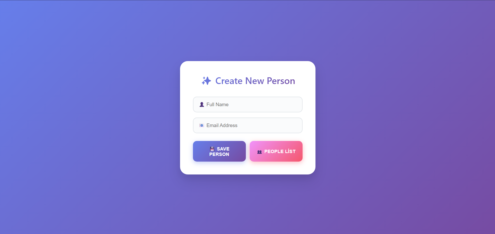

### People List (/people)
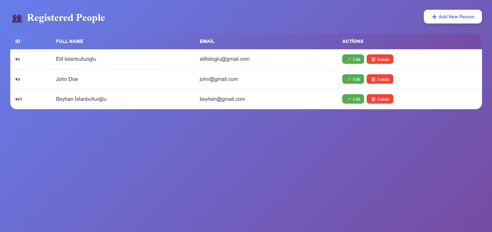

### Edit Operation
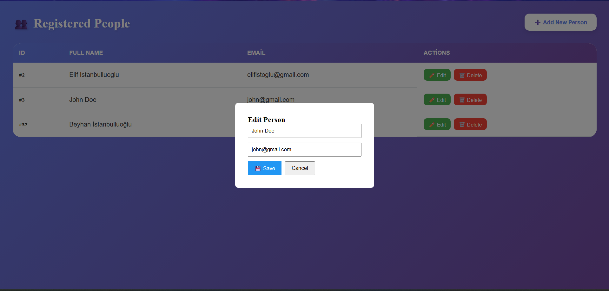

### After Edit Operation
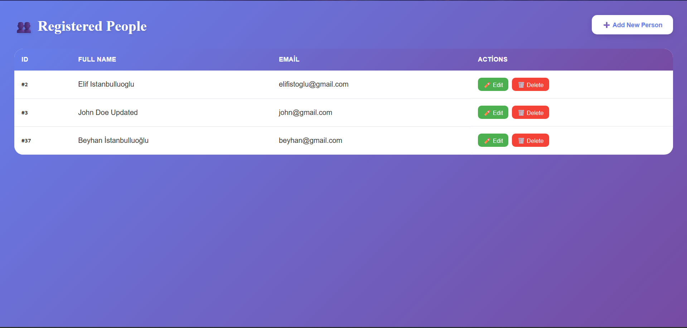

### Delete Confirmation
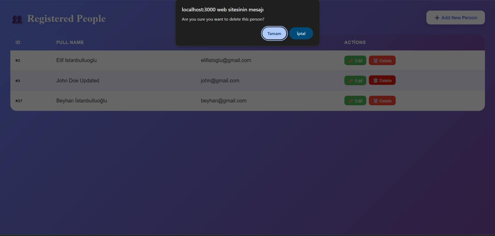

### Person succesfully created 
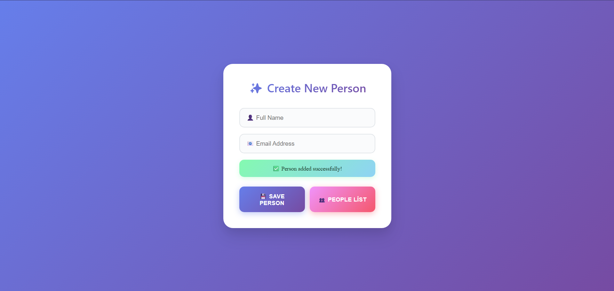

### Unique Email Warning
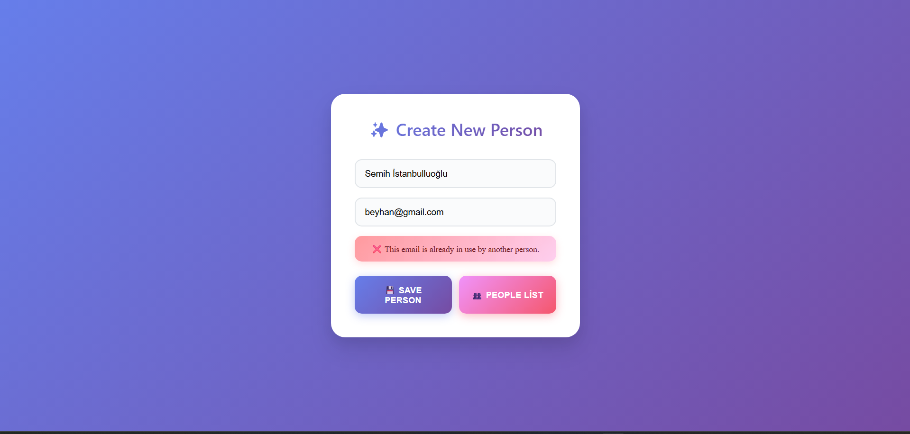

### Unvalid Email Warning
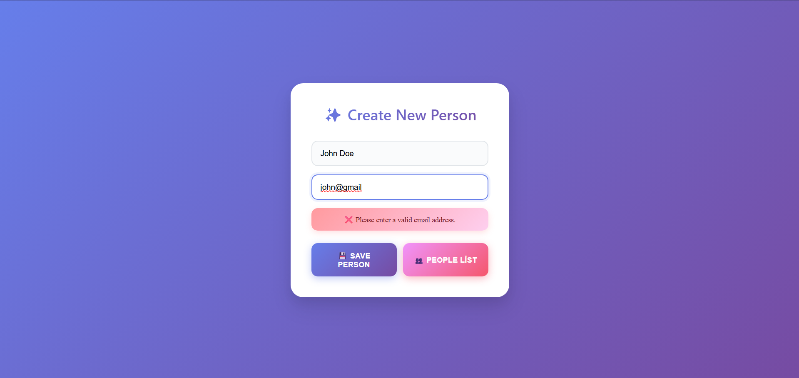

---

## 📸 Postman api endpoints screenshots

### GET All People
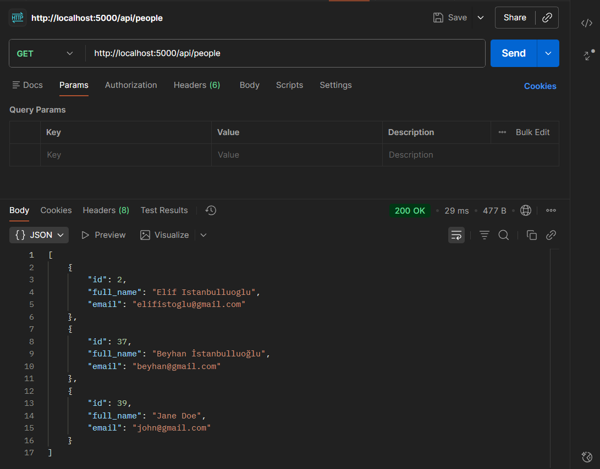

### GET Person by ID
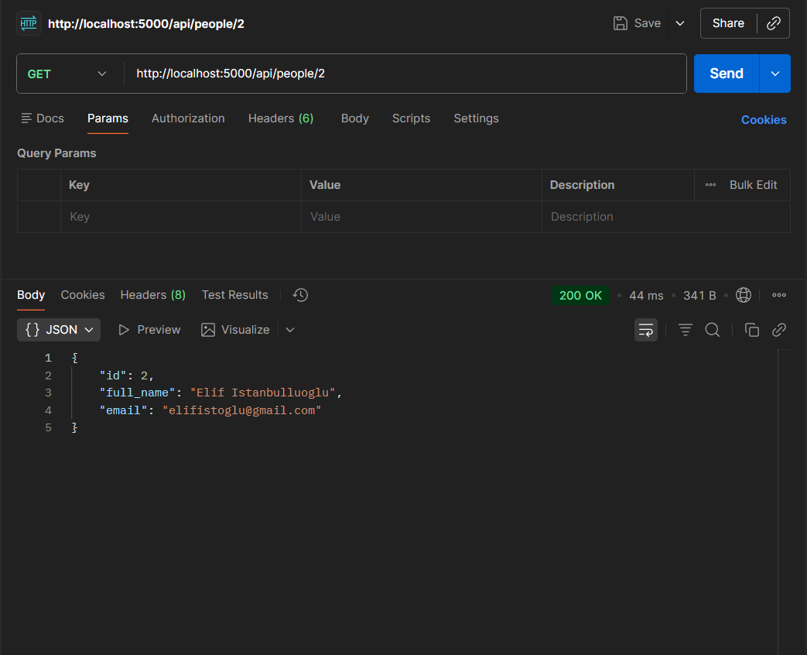

### POST - Create Person
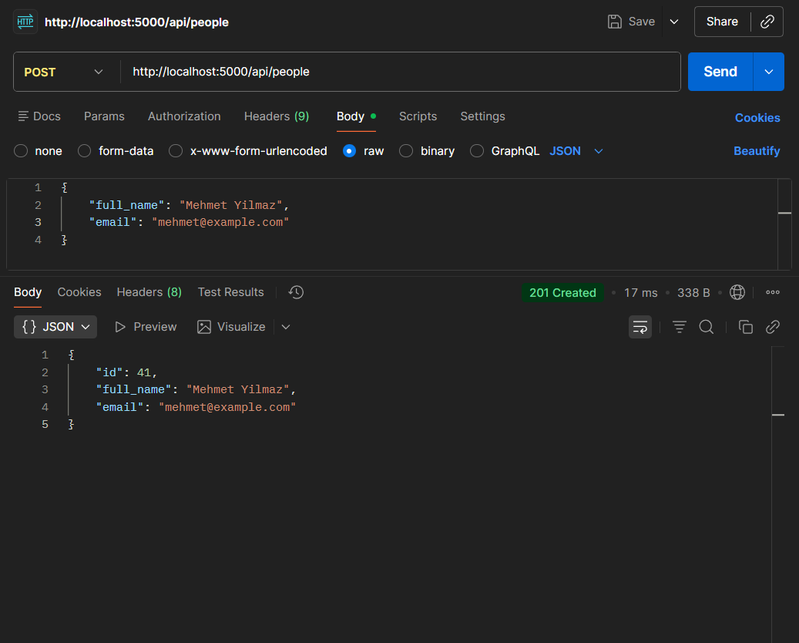

### PUT - Update Person
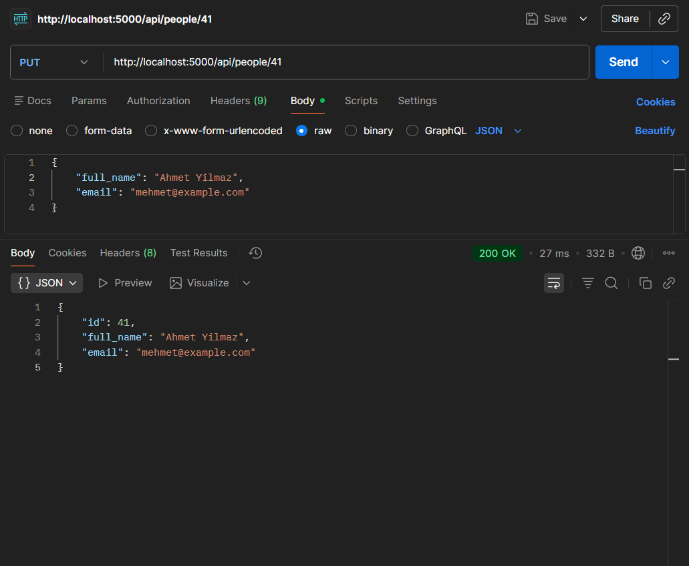

### DELETE - Delete Person
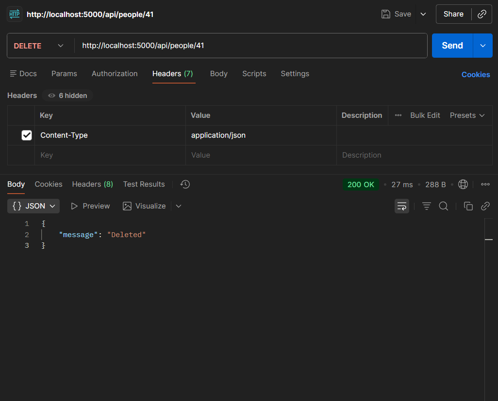

### 404 - Not Found
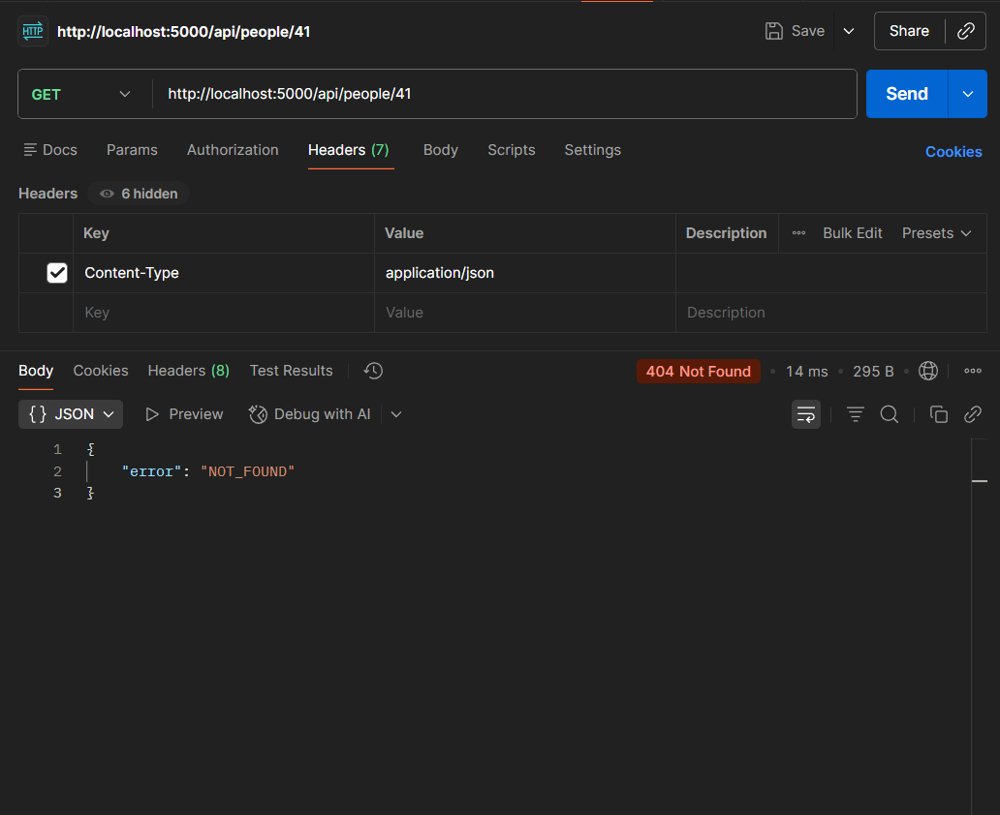


## 📁 Project Structure
```
project-root/
├── docker-compose.yml
├── .env.example
├── README.md
├── screenshots
|    ├── added-succesdully.png
|    ├── after-edit.png
|    ├── delete.png
|    ├── edit.png
|    ├── form-page.png
|    ├── people-list.png
|    ├── unique-email.png
|    ├── valid-email.png
|    ├── get-ok.png
|    ├── get-ok-id.png
|    ├── post-ok.png
|    ├── put-ok.png
|    ├── delete-ok.png
|    ├── not-found.png
├── db/
│   └── init.sql
├── backend/
│   ├── Dockerfile
│   ├── package.json
│   └── src/
│       └── index.js
└── frontend/
    ├──public
    |   ├── index.html
    ├── Dockerfile
    ├── package.json
    └── src/
        ├── App.jsx
        ├── index.js
        ├── App.css
        ├── PeoplePage.css
        ├── pages/
        │   ├── RegisterPage.jsx
        │   └── PeoplePage.jsx
        └── components/
            └── EditModal.jsx
